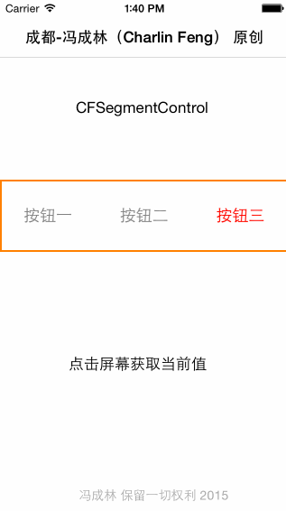

# CFSegmentControl
双版本分段选取控件
-----
    Charlin出框架的目标：简单、易用、实用、高度封装、绝对解耦！
    
-----

  

框架截图 CUT
===============
 
 

框架说明 EXPLAIN
===============
本框架以swift语言开发，但swift和oc均可使用。框架不在简单与复杂，在于功能实用。 
成都iOS开发群： 
二群：369870753（新开，新鲜着呢，快加）  
一群：163865401（已爆满，加不上了）    

 

####框架特性： 
>1.双语可用：swift与oc均可实现调用。 
>2.可自定义样式，并以closure回调，无需代理。 

 
框架依赖 DEPENDENCE
===============
无

 
使用说明 USAGE
===============

#### 1. swift使用：
        var control1 = CFSegmentControl(itemsClosure: { () -> NSArray in
            
            //返回一个btn数组即可
            
            //实际使用Btn请封装普通样式及选中样式
            var btn1 = UIButton()
            btn1.setTitleColor(UIColor.grayColor(), forState: UIControlState.Normal)
            btn1.setTitleColor(UIColor.redColor(), forState: UIControlState.Selected)
            btn1.setTitle("按钮一", forState: UIControlState.Normal)
            
            var btn2 = UIButton()
            btn2.setTitleColor(UIColor.grayColor(), forState: UIControlState.Normal)
            btn2.setTitle("按钮二", forState: UIControlState.Normal)
            btn2.setTitleColor(UIColor.redColor(), forState: UIControlState.Selected)
            
            var btn3 = UIButton()
            btn3.setTitleColor(UIColor.grayColor(), forState: UIControlState.Normal)
            btn3.setTitleColor(UIColor.redColor(), forState: UIControlState.Selected)
            btn3.setTitle("按钮三", forState: UIControlState.Normal)
            
            return [btn1,btn2,btn3]
            
        }) { (selectedIndex) -> Void in
            
            println("选中\(selectedIndex)")
        }

        control1.frame = CGRectMake(0, 200, 320, 80)
        control1.layer.borderWidth = 2
        control1.layer.borderColor = UIColor.orangeColor().CGColor
        self.view.addSubview(control1)
        self.control1 = control1

#### 2. oc使用：
    CFSegmentControl *control = [[CFSegmentControl alloc] initWithItemsClosure:^NSArray *{
    
        //返回一个btn数组即可
            
        //实际使用Btn请封装普通样式及选中样式
        UIButton *btn1 = [UIButton buttonWithType:UIButtonTypeCustom];
        [btn1 setTitle:@"按钮一" forState:UIControlStateNormal];
        [btn1 setTitleColor:[UIColor grayColor] forState:UIControlStateNormal];
        [btn1 setTitleColor:[UIColor redColor] forState:UIControlStateSelected];
        
        UIButton *btn2 = [UIButton buttonWithType:UIButtonTypeCustom];
        [btn2 setTitle:@"按钮二" forState:UIControlStateNormal];
        [btn2 setTitleColor:[UIColor grayColor] forState:UIControlStateNormal];
        [btn2 setTitleColor:[UIColor redColor] forState:UIControlStateSelected];
        
        UIButton *btn3 = [UIButton buttonWithType:UIButtonTypeCustom];
        [btn3 setTitle:@"按钮三" forState:UIControlStateNormal];
        [btn3 setTitleColor:[UIColor grayColor] forState:UIControlStateNormal];
        [btn3 setTitleColor:[UIColor redColor] forState:UIControlStateSelected];
        
        UIButton *btn4 = [UIButton buttonWithType:UIButtonTypeCustom];
        [btn4 setTitle:@"按钮四" forState:UIControlStateNormal];
        [btn4 setTitleColor:[UIColor grayColor] forState:UIControlStateNormal];
        [btn4 setTitleColor:[UIColor redColor] forState:UIControlStateSelected];
        
        return @[btn1,btn2,btn3,btn4];
        
    } clickItemAtIndex:^(NSInteger index) {
        NSLog(@"当前:%@",@(index));
    }];
    
    control.frame = CGRectMake(0, 0, 320, 60);
    
    control.layer.borderColor = [UIColor brownColor].CGColor;
    control.layer.borderWidth = 1;
    [self.view addSubview:control];
    

  
版权 RIGHTS
===============
本框架由冯成林原创，保留一切权利！
